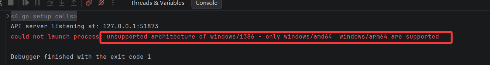

**Go调试器delve支持32位进程调试。**




原生的delve是不支持调试32位应用程序的，但是我的项目为了兼容32位Windows，需要32位编译，又需要调试，只能让delve支持32位了。


**构建**

在delve\cmd\dlv下执行命令powershell命令,

```
$env:GOARCH="386";go build -o dlv_32.exe .
```

