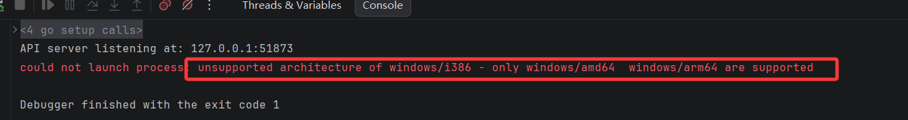
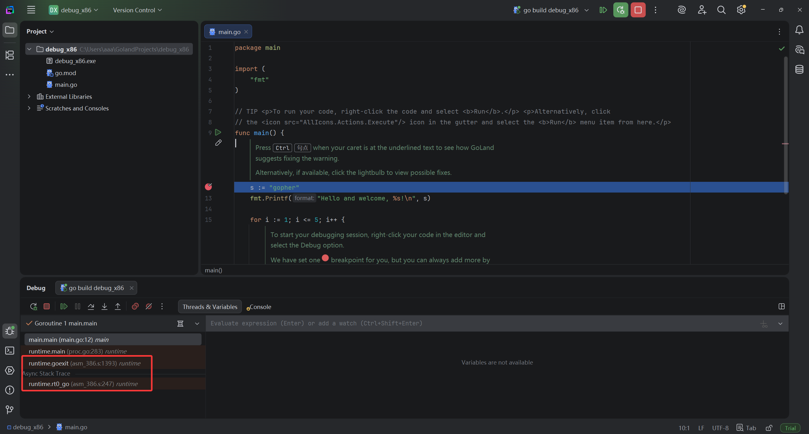

**Go调试器delve支持32位进程调试。**




原生的delve是不支持调试32位应用程序的，这个项目给delve扩充了下功能，支持调试windows 32位应用。


**构建**

在delve\cmd\dlv下执行命令powershell命令,

```
$env:GOARCH="386";go build -o dlv_32.exe .
```





**2026/1/13** 能够32位编译delve

**2026/1/18** 提升32位兼容性

**2026/1/22** 替换goland原生delve基本功能能正常用
